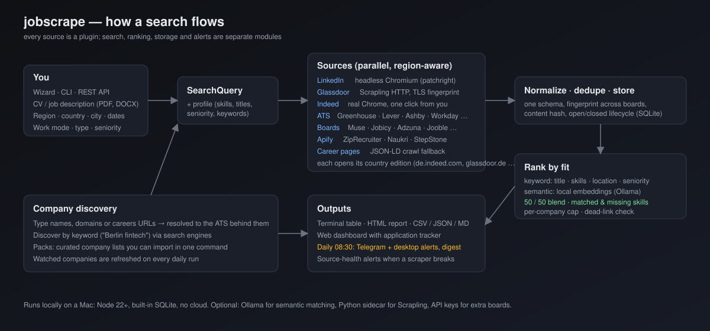
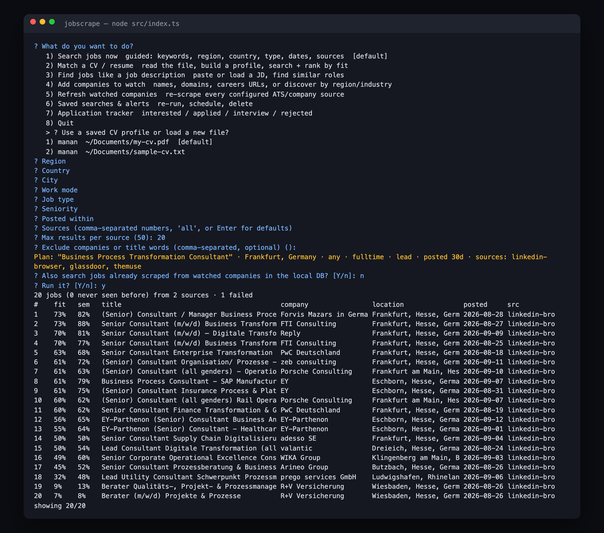
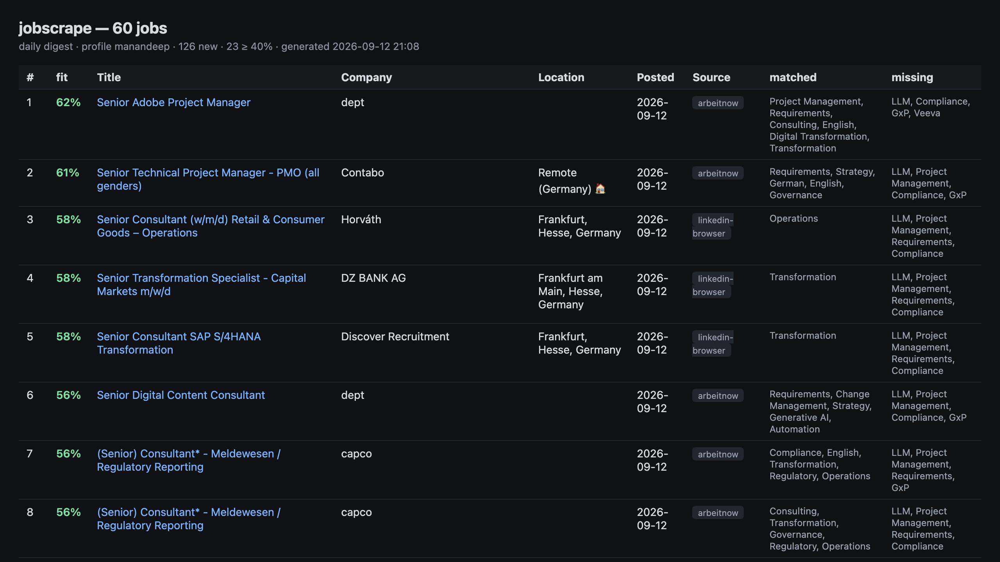
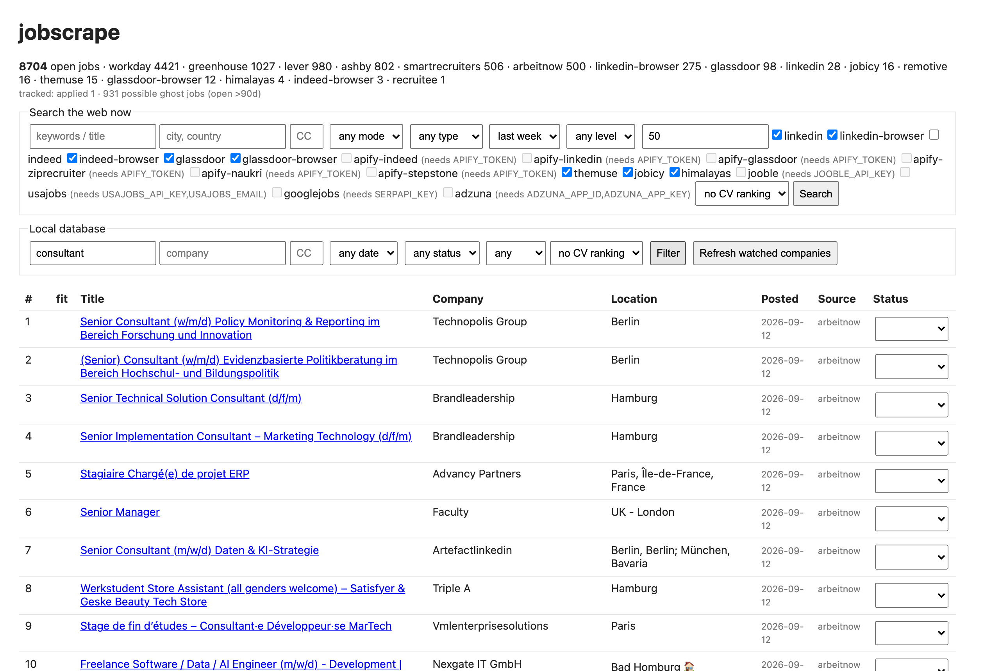

<p align="center">
  
</p>

<h1 align="center">jobscrape</h1>

<p align="center">
  <b>One interactive job search across LinkedIn, Indeed, Glassdoor, the big boards, every major ATS and any career page.</b><br>
  Reads your CV, asks the right questions, ranks every posting by fit, tracks your applications and messages you every morning.
</p>

<p align="center">
   
   
   
   
  
</p>

```bash
npm install && node src/index.ts        # the wizard
node src/index.ts serve                 # the dashboard on http://localhost:3210
```

## Why it exists

Job boards are silos, career pages are chaos, and "search everything" tools scrape the world and hand you noise. jobscrape
does the opposite. It asks what you actually want, hits only the sources that cover that region, dedupes across boards,
scores each job against **your** CV (keyword match plus a local semantic embedding), and tells you which skills matched
and which are missing. Then it keeps doing that every morning without you.

## The four things people use it for

### 1 · A guided search instead of a search box



Keywords → region → country → city → work mode → job type → seniority → posted-within → sources. Every answer narrows the
plan; the plan is shown before anything runs. Pick a saved CV profile and the wizard pre-fills itself. Results are a paged
table you can act on: open, read the description, set a status, verify links, export an HTML report, save as an alert.

### 2 · Ranked by fit, and it shows its work



Two scores blended 50/50. **Keyword**: title overlap, skills present in the description, location and seniority fit.
**Semantic**: your CV and each job embedded locally with Ollama (`nomic-embed-text`), compared by cosine similarity, so
"K8s" finds "Kubernetes" and "process architecture" finds "operating model design". Every row says which skills matched
and which the posting wants that your CV does not mention. Embeddings are cached; ranking 300 jobs takes seconds once
and milliseconds after.

### 3 · A dashboard and tracker



Live web search with source checkboxes and CV ranking, filters over everything scraped so far, a status dropdown per job
(interested · applied · interview · offer · rejected), a ghost-job flag for postings open longer than 90 days, and a
"seen on N boards" counter. Same data is available as a JSON API.

### 4 · A morning that starts with a Telegram message

Registered as a launchd agent at 08:30. It refreshes every watched company, re-runs your saved searches, ranks what is
new, checks that the top links are still live, caps results per employer, writes a Markdown + HTML digest, and sends the
top matches to Telegram, a webhook and the macOS notification centre. If a scraper breaks, you get a separate alert
naming the source, because a silent zero looks exactly like "no jobs today".

## What is under the hood, in one table

| Board or platform | How it is fetched | Notes |
|---|---|---|
| **LinkedIn** | headless Chromium via patchright, or the guest HTTP endpoint for quick checks | up to 300 per query with descriptions; optional one-time sign-in |
| **Glassdoor** | Scrapling HTTP with a real Chrome TLS fingerprint, no browser | headless, ~2 s per query, city-scoped via Glassdoor's own lookup; after heavy use Glassdoor challenges the address and the source hands over to the browser one |
| **Indeed** | real Chrome in a visible window on the country edition | Cloudflare needs one click from you the first time; the session is saved |
| **Greenhouse · Lever · Ashby · Workable · SmartRecruiters · Recruitee · Personio · Workday** | public ATS APIs | any company; `import "N26, Personio, sap.com"` resolves names to boards |
| **The Muse · Jobicy · Himalayas · Remotive · RemoteOK · Arbeitnow** | open JSON APIs | keyless |
| **Adzuna · Jooble · USAJOBS · Google for Jobs** | official APIs | free keys |
| **ZipRecruiter · Naukri · StepStone · Glassdoor/Indeed/LinkedIn at volume** | Apify actors | pay per result |
| **Any career page** | JSON-LD JobPosting crawl | fallback when nothing else fits |

Every source declares which countries it covers, so an India search never hits StepStone and a Germany search never hits
USAJOBS. Indeed and Glassdoor open their country editions. Whole-region searches fan LinkedIn out per country.

## Design principles

- **Ask, don't crawl.** The wizard scopes every run; nothing scrapes "everything".
- **Cheapest tier that works.** Plain HTTP → TLS-fingerprinted HTTP → headless browser → visible browser, per source.
- **Never fake a human.** When a site shows a "verify you are human" check, the app opens a window and waits for you. It
  does not solve CAPTCHAs, and that is deliberate.
- **Explainable ranking.** Every score decomposes into title, skills, location, seniority and semantic parts.
- **Assume scrapers break.** Content hashes, run metrics, a zero-result guard, and health alerts on fetch-count drops.
- **Local first.** SQLite, local embeddings, your browser profile. No account, no cloud, no data leaves the machine
  unless you add an API key.

The long version of the trade-offs, including what was tried against Cloudflare and why some paths were rejected, is in
[CHALLENGES.md](CHALLENGES.md).

---

## Commands

```bash
node src/index.ts search -k "data engineer" -l "Berlin, Germany" -c DE --posted 7d --remote hybrid --sources linkedin,themuse --profile me --save berlin-de
node src/index.ts match ~/cv.pdf --name me --local        # profile + search + rank; --local also ranks watched-company jobs
node src/index.ts import "N26, Personio, sap.com, https://stripe.com/jobs"
node src/index.ts import config/packs/germany-tech.txt          # packs: big-tech, germany-tech
node src/index.ts discover "Berlin fintech" --add
node src/index.ts detect https://www.anthropic.com/careers --add
node src/index.ts run                                     # refresh all watched companies/boards
node src/index.ts schedule --interval 30                  # refresh + saved-search alerts every 30 min + API
node src/index.ts sources                                 # adapters, which need keys, configured sources
node src/index.ts export --format csv
```

## Daily schedule with alerts

`node src/index.ts daily --profile NAME` does one unattended run: refresh watched companies, run the profile's saved
searches (created from its keywords on first run, headless sources only), rank everything new against the profile,
send a macOS notification (and a Slack/Discord webhook if `JOBSCRAPE_WEBHOOK_URL` is set) with the top matches, and
write `data/digests/<date>.md`. Indeed is left out of unattended runs because it needs a visible window.

Each daily run also checks **source health**: a source whose last run failed, or whose fetch count fell below half its
7-day average, is listed in the log and sent as a separate alert (`JOBSCRAPE_HEALTH_ALERTS=0` to silence).
`node src/index.ts health` prints the same report on demand, plus sources with no new jobs for 14 days. Postings older
than 40 days never reach a digest (`JOBSCRAPE_MAX_AGE_DAYS`), and consecutive saved searches that hit LinkedIn are
spaced 10 seconds apart to stay under its rate limit.

On macOS it is registered as a launchd agent (`~/Library/LaunchAgents/com.jobscrape.daily.plist`, 08:30 every day,
logs in `logs/`). Useful commands:

```bash
launchctl kickstart -k gui/$(id -u)/com.jobscrape.daily     # run it now
launchctl bootout gui/$(id -u)/com.jobscrape.daily          # stop the schedule
launchctl bootstrap gui/$(id -u) ~/Library/LaunchAgents/com.jobscrape.daily.plist   # re-enable
```

Edit the saved searches from the wizard ("Saved searches & alerts") or delete them to have `daily` rebuild them from
the profile. Set `JOBSCRAPE_NOTIFY_EMPTY=1` to get a notification even when nothing matched.

## Sources and what they need

| source | kind | key needed | notes |
|---|---|---|---|
| linkedin-browser | board | none | real Chromium: scrolls the result list (up to 300), opens jobs for descriptions, uses your login if you ran `login linkedin` |
| indeed-browser | board | none | real Chrome, visible window (Indeed hard-blocks headless), country edition (de.indeed.com, uk.indeed.com, in.indeed.com, ...). Anonymous sessions get page 1 only; sign in via `login indeed` for more pages and full descriptions |
| glassdoor | board | Scrapling sidecar | headless, no browser: Scrapling's curl_cffi request with a real Chrome TLS fingerprint gets the page directly. Country edition, city via Glassdoor's location lookup; about 30 jobs per query (Glassdoor paginates with JavaScript only, so vary keywords for more). Default when the sidecar is installed |
| glassdoor-browser | board | none | real Chrome, visible window; fallback when the sidecar is not installed |
| linkedin | board | none | plain-HTTP guest search, ~25/page, rate-limited; quick checks without a browser |
| indeed | board | none → `APIFY_TOKEN` | plain HTTP, usually blocked by Cloudflare; falls back to an Apify actor |
| apify-glassdoor, apify-ziprecruiter, apify-naukri, apify-stepstone, apify-linkedin, apify-indeed | board | `APIFY_TOKEN` | pay-per-result actors from the Apify Store, about $1–5 per 1000 jobs |
| googlejobs | aggregator | `SERPAPI_KEY` (free tier) | Google for Jobs: aggregates Indeed, Glassdoor, LinkedIn and company postings per country; the legal fallback when those boards block |
| adzuna | aggregator | `ADZUNA_APP_ID/KEY` (free) | 19 countries, structured salary |
| jooble | aggregator | `JOOBLE_API_KEY` (free) | 70 countries |
| themuse, jobicy, himalayas, remotive, remoteok, arbeitnow | board | none | open JSON APIs |
| usajobs | board | `USAJOBS_API_KEY` + email (free) | US federal |
| greenhouse, lever, ashby, workable, smartrecruiters, recruitee, personio | ats | none | public JSON/XML per company; covers most tech and mid-market employers |
| workday | ats | none | tenant search API; key is `host\|tenant\|site` or a registry name (gsk, novartis, astrazeneca, roche, sanofi, pfizer, iqvia, msd, bms, biogen, moderna, takeda). Big pharma and most large enterprises. `detect` recognises myworkdayjobs.com URLs |
| careerpage | generic | none (Playwright optional) | JSON-LD JobPosting + shallow crawl for anything else |

Keys go in `.env` (see `.env.example`); load them with `set -a; source .env; set +a` or your shell's equivalent.

**Scrapling sidecar (optional, Python).** [Scrapling](https://github.com/D4Vinci/Scrapling) adds two things the Node
stack lacks: HTTP requests with a real browser TLS/HTTP2 fingerprint (curl_cffi), and adaptive selectors that relocate
elements after a site changes its markup. `npm run setup:scrapling` creates `scrapling/.venv` and downloads its
browsers; `scrapling/fetch.py` is a tiny JSON-in/JSON-out bridge the Node side spawns per request. Today it powers the
headless `glassdoor` source. It does not power Indeed: Indeed's Cloudflare check stops every headless path, and the only
headless route Scrapling offers is automating the "verify you are human" step, which this project leaves out on purpose.

**Regions.** Every source declares where it has coverage (`src/regions.ts`). The wizard only offers sources that cover the
chosen country, `search` skips the rest with a note, and the browser adapters open the board's country edition. Picking
a whole region without a country makes LinkedIn search each country of that region in turn and merge the results, and
results from every source are kept only if their location names a place in that region (or they are remote). Indeed
and Glassdoor jobs get the country of the edition they came from even when the card shows a bare city.

**Launcher.** Double-click `JobScrape.command` in Finder to open the wizard in a terminal.

**Browser sessions.** The `*-browser` sources share one persistent profile in `data/browser-profile`, driven through
patchright (a Playwright fork that hides the automation fingerprint Cloudflare keys on) and your installed Google
Chrome when present. One-time setup: `node src/index.ts login indeed,glassdoor --country DE` opens a visible window;
click the "I'm human" checkbox on each site and optionally sign in (the app never sees the password). The clearance
and login cookies are then reused. LinkedIn runs headless; Indeed and Glassdoor always open a visible window because
both hard-block headless Chrome, so expect a Chrome window to appear during those searches (it closes on its own).
`JOBSCRAPE_BROWSER_CHANNEL=bundled` forces the bundled Chromium; `JOBSCRAPE_HEADFUL=1` shows the window for all sources.

## How it works

```
wizard / CLI / API  ─▶  SearchQuery  ─▶  search adapters (parallel)  ─▶  normalize + dedup  ─▶  SQLite  ─▶  rank by CV profile
config/sources.json ─▶  runner       ─▶  ATS / board adapters        ─▶  upsert + close-missing  ─┘
```

Every job carries `first_seen`, `last_seen`, `closed_at`, a content hash (unchanged rows are touched, not rewritten),
a cross-source fingerprint, the raw payload for re-processing, and an optional status. Adding a source is one file
exporting a `SourceAdapter` with `fetchJobs` (configured sources) and/or `search` (query-driven), plus one line in
`src/adapters/index.ts`.

See [CHALLENGES.md](CHALLENGES.md) for what is hard about "all job boards and all companies" and how this design
attacks each part.
